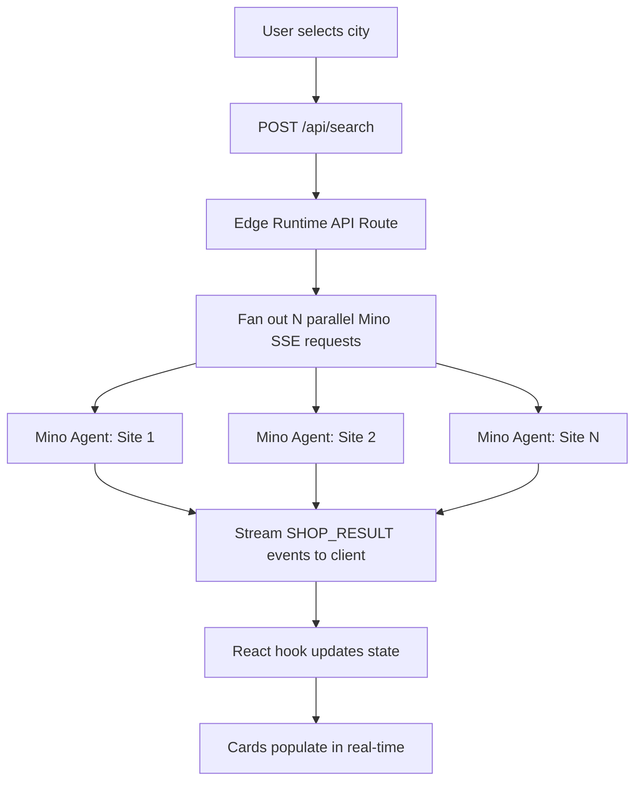

# Vietnam Bike Price Scout

**Live Demo**: https://viet-bike-scout.vercel.app/

Compare motorbike rental prices across Vietnam in seconds, not hours. Powered by TinyFish Mino — scrapes 18 rental shop websites in parallel via SSE streaming and displays real-time results as they arrive.

## Demo

> Search HCMC → watch 5 shops populate live as Mino agents complete

[Screenshot placeholder — replace with actual screenshot]

## The Problem

Finding motorbike rental prices in Vietnam means visiting 10-20 different websites manually. Each site has different formats, some require navigation, some have popups. It takes 1-2 hours to compare prices across a single city.

Mino solves this in ~60 seconds by running all sites in parallel.

## Code Snippet

```typescript
// Fan out parallel Mino requests, stream results back to client
const tasks = sites.map((url, index) =>
  (async () => {
    await sleep(index * 500); // stagger 500ms
    const response = await fetch('https://agent.tinyfish.ai/v1/automation/run-sse', {
      method: 'POST',
      headers: { 'X-API-Key': apiKey, 'Content-Type': 'application/json' },
      body: JSON.stringify({ url, goal: GOAL_PROMPT }),
    });
    // Parse SSE stream with getReader() + buffer pattern
    const reader = response.body!.getReader();
    // ... stream results to client as they complete
  })()
);
await Promise.allSettled(tasks);
```

## Mino Goal Prompt

```
You are extracting motorbike rental pricing from this website.
Steps:
1. Navigate to the pricing or rental page if not already there
2. Handle any popups or cookie banners by dismissing them
3. Find ALL motorbike/scooter listings with their prices
4. If there is a "Load More" button or pagination, click through all pages
5. Extract: bike name, engine_cc, type (scooter/semi-auto/manual/adventure),
   daily/weekly/monthly price in USD, deposit, availability

Return JSON: {"shop_name":"...","city":"...","website":"...","bikes":[...],"notes":"..."}
```

## Sample Output

```json
{
  "shop_name": "Wheelie Saigon",
  "city": "HCMC",
  "website": "https://wheelie-saigon.com",
  "bikes": [
    {
      "name": "Honda Wave 110",
      "engine_cc": 110,
      "type": "semi-auto",
      "price_daily_usd": 8,
      "price_weekly_usd": 50,
      "price_monthly_usd": 120,
      "currency": "USD",
      "deposit_usd": 20,
      "available": true
    }
  ],
  "notes": "Helmet included, free delivery in district 1"
}
```

## How to Run

```bash
git clone https://github.com/giaphutran12/project1-tinyfish.git
cd project1-tinyfish
npm install
cp .env.example .env
# Add your TINYFISH_API_KEY to .env
npm run dev
```

Open http://localhost:3000, select a city, watch results stream in.

## Architecture



**Stack**: Next.js 16 + React 19 + Tailwind v4 + shadcn/ui + TypeScript  
**Hosting**: Vercel (Edge Runtime for streaming)  
**API**: TinyFish Mino SSE endpoint
