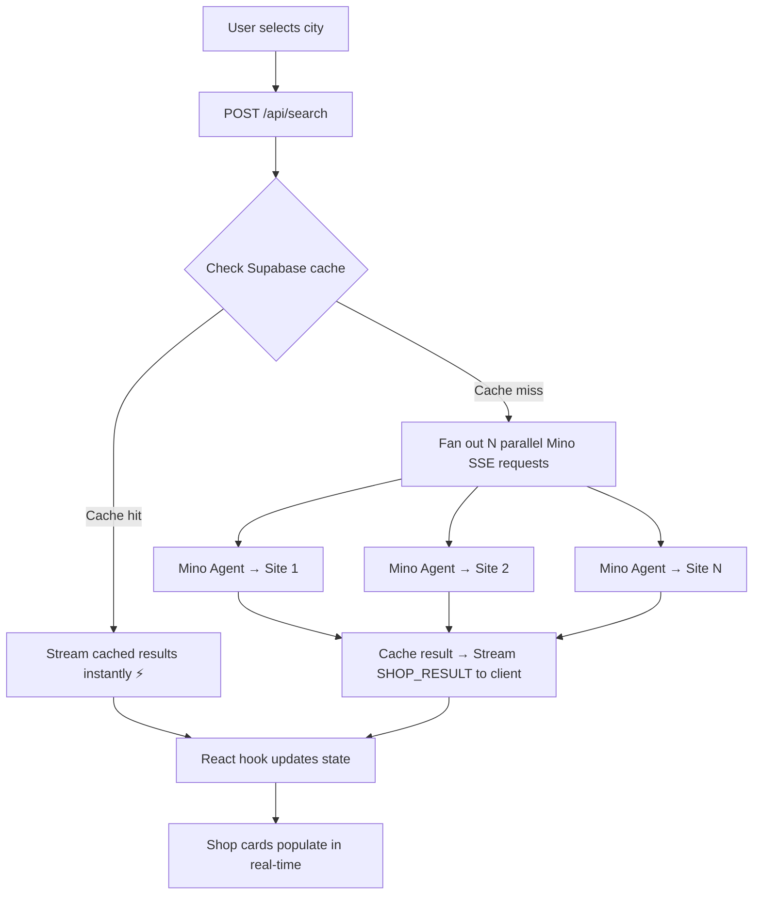

# Vietnam Bike Price Scout

**Live Demo:** [viet-bike-scout.vercel.app](https://viet-bike-scout.vercel.app/)

Compare motorbike rental prices across Vietnam in seconds, not hours. Vietnam Bike Price Scout uses the [TinyFish Mino API](https://docs.tinyfish.ai) to scrape **18 rental shop websites in parallel** and streams results back in real-time via SSE — so you see prices appear live as each shop finishes loading.

**Demo Video:**

> _TODO: Add demo video link_


---

## Why This Exists

If you're renting a motorbike in Vietnam (which you should — it's the best way to get around), you'll quickly discover that pricing info is scattered across dozens of small local shop websites. Each site has a different layout, some bury prices behind navigation, some show prices in VND, some in USD.

Comparing prices across just one city means opening 5-6 tabs, clicking through menus, and manually noting down prices. For all 4 major cities? That's 18 websites and easily 1-2 hours of tedious work.

**Mino solves this in ~60 seconds** by running browser agents on all sites in parallel, extracting structured pricing data, and streaming results back as they complete.

---

## How TinyFish Mino Is Used

The app sends one Mino SSE request per rental website. Each request tells Mino to:
1. Navigate to the pricing page
2. Dismiss popups/cookie banners
3. Click through pagination or "Load More" buttons
4. Extract every bike listing with name, engine size, type, and price
5. Return structured JSON

All requests run **in parallel** (staggered 500ms apart to avoid overwhelming the API). Results stream back to the browser via Server-Sent Events — so you see shops populate one by one as agents finish.

### Code Snippet — SSE Fan-Out Pattern

From `src/app/api/search/route.ts`:

```typescript
// Fan out parallel Mino requests — one per rental website
const tasks = uncachedSites.map((url, index) =>
  (async () => {
    await sleep(index * REQUEST_STAGGER_MS); // stagger 500ms

    const response = await fetch(MINO_SSE_URL, {
      method: "POST",
      headers: {
        "Content-Type": "application/json",
        Accept: "text/event-stream",
        "X-API-Key": apiKey,
      },
      body: JSON.stringify({ url, goal: GOAL_PROMPT }),
    });

    // Parse SSE stream with getReader() + buffer pattern
    const reader = response.body!.getReader();
    const decoder = new TextDecoder();
    let buffer = "";

    while (true) {
      const { done, value } = await reader.read();
      if (done) break;

      buffer += decoder.decode(value, { stream: true });
      const lines = buffer.split("\n");
      buffer = lines.pop() ?? "";

      for (const line of lines) {
        if (!line.startsWith("data: ")) continue;
        const event = JSON.parse(line.slice(6));
        if (event.status === "COMPLETED" && event.resultJson) {
          // Cache result to Supabase, then stream to client
          await cacheResult(supabase, city, url, event.resultJson);
          enqueue({ type: "SHOP_RESULT", shop: event.resultJson });
        }
      }
    }
  })()
);

await Promise.allSettled(tasks);
```

### Mino Goal Prompt

```text
You are extracting motorbike rental pricing from this website.

Steps:
1. Navigate to the pricing or rental page if not already there
2. Handle any popups or cookie banners by dismissing them
3. Find ALL motorbike/scooter listings with their prices
4. If there is a "Load More" button or pagination, click through all pages
5. Extract: bike name, engine_cc, type (scooter/semi-auto/manual/adventure),
   daily/weekly/monthly price in USD, deposit, availability

Return JSON: {"shop_name":"...","city":"...","website":"...","bikes":[...],"notes":"..."}
```

---

## Sample JSON Output

Real data extracted from Wheelie Saigon (HCMC):

```json
{
  "shop_name": "Wheelie Saigon",
  "city": "HCMC",
  "website": "https://wheelie-saigon.com/",
  "bikes": [
    {
      "name": "Yamaha WR155 Super Motard",
      "engine_cc": 155,
      "type": "adventure",
      "price_daily_usd": 40,
      "price_weekly_usd": null,
      "price_monthly_usd": null,
      "deposit_usd": 20,
      "available": true
    },
    {
      "name": "Honda Scoopy 110",
      "engine_cc": 110,
      "type": "scooter",
      "price_daily_usd": 6,
      "price_weekly_usd": null,
      "price_monthly_usd": null,
      "deposit_usd": 20,
      "available": true
    }
  ],
  "notes": "Prices converted from VND (1 USD = 25,000 VND). Includes free delivery in Saigon, helmet, fuel, and insurance."
}
```

---

## How to Run

### Prerequisites

- **Node.js 18+** (tested on Node 20)
- **npm** (comes with Node.js)
- A **TinyFish API key** — get one at [tinyfish.ai](https://tinyfish.ai)
- _(Optional)_ A **Supabase** project for caching — the app works fine without it, caching just makes repeat searches instant

### Step 1: Clone and install

```bash
git clone https://github.com/giaphutran12/project1-tinyfish.git
cd project1-tinyfish
npm install
```

### Step 2: Set up environment variables

```bash
cp .env.example .env
```

Open `.env` and fill in your keys:

```env
# Required — your TinyFish Mino API key
TINYFISH_API_KEY=sk-tf-your-key-here

# Optional — enables Supabase caching (6h TTL)
# Without these, the app still works but every search hits Mino live
NEXT_PUBLIC_SUPABASE_URL=https://your-project.supabase.co
SUPABASE_SERVICE_ROLE_KEY=eyJ...your-service-role-key
```

> **Where to get a TinyFish API key:** Sign up at [tinyfish.ai](https://tinyfish.ai), go to Dashboard → API Keys, and create one. Intern API credits are unlimited.

> **Supabase setup (optional):** Create a free project at [supabase.com](https://supabase.com), then run the migration to create the cache table:
> ```bash
> npx supabase login
> npx supabase link --project-ref your-project-ref
> npx supabase db push
> ```

### Step 3: Run the dev server

```bash
npm run dev
```

Open [http://localhost:3000](http://localhost:3000) in your browser.

### Step 4: Try it out

1. **Select a city** from the dropdown (start with Da Nang — it's fastest, ~55 seconds)
2. **Click Search** and watch the progress bar fill as Mino agents scrape each website
3. **Results appear in real-time** — each shop card pops in as its agent finishes
4. **Search the same city again** — if Supabase is configured, cached results appear instantly with a ⚡ badge

### What to expect

| City | Sites | First search | Cached search |
|------|-------|-------------|---------------|
| Ho Chi Minh City | 5 shops | ~2-3 minutes | Instant |
| Hanoi | 5 shops | ~5-9 minutes | Instant |
| Da Nang / Hoi An | 6 shops | ~1-2 minutes | Instant |
| Nha Trang / Mui Ne | 2 shops | ~1-2 minutes | Instant |

> **Note:** First searches take time because Mino is literally browsing each website with a real browser, navigating pages, and extracting data. This is NOT a simple API call — it's full browser automation. The cache makes subsequent searches instant.

---

## Architecture



### Key design decisions

- **Cache-aside pattern**: Check Supabase first → stream cached results immediately → only scrape uncached sites via Mino → upsert results after each success
- **Cache-before-stream**: Results are written to Supabase _before_ being streamed to the client, so if a user closes their browser mid-search, completed shops are still cached
- **Graceful degradation**: If Supabase env vars are missing, the app works identically — it just skips caching and always scrapes live
- **500ms stagger**: Requests to Mino are staggered to avoid overwhelming the API queue

---

## Tech Stack

| Layer | Technology |
|-------|-----------|
| Framework | Next.js 16 + React 19 |
| Styling | Tailwind CSS v4 + shadcn/ui |
| Language | TypeScript 5.9 |
| API | TinyFish Mino (SSE streaming) |
| Caching | Supabase (PostgreSQL) |
| Hosting | Vercel (800s max duration) |
| Runtime | Node.js (required for long SSE streams) |

---

## Covered Sites (18 total)

| City | Rental Shops |
|------|-------------|
| **HCMC** | tigitmotorbikes.com, wheelie-saigon.com, saigonmotorcycles.com, stylemotorbikes.com, theextramile.co |
| **Hanoi** | motorbikerentalinhanoi.com, offroadvietnam.com, rentbikehanoi.com, book2wheel.com, motorvina.com |
| **Da Nang / Hoi An** | motorbikerentaldanang.com, danangmotorbikesrental.com, danangbike.com, motorbikerentalhoian.com, hoianbikerental.com, tuanmotorbike.com |
| **Nha Trang / Mui Ne** | moto4free.com, motorbikemuine.com |

---

## Troubleshooting

| Problem | Solution |
|---------|---------|
| Search times out | Normal for first search — some sites take 5-9 minutes. Cached searches are instant. |
| No results for a shop | Some sites occasionally fail to load for Mino. Try again — results are cached per-shop, so successful shops won't need re-scraping. |
| `TINYFISH_API_KEY` error on startup | Make sure your `.env` file exists and the key is set. The app validates env vars with Zod on startup. |
| Supabase errors in console | Check that `NEXT_PUBLIC_SUPABASE_URL` and `SUPABASE_SERVICE_ROLE_KEY` are set correctly. Or just remove them — the app works without caching. |
| VND prices showing | The Mino prompt asks for USD conversion, but some sites only show VND. The frontend auto-converts VND → USD at 25,000:1. |
